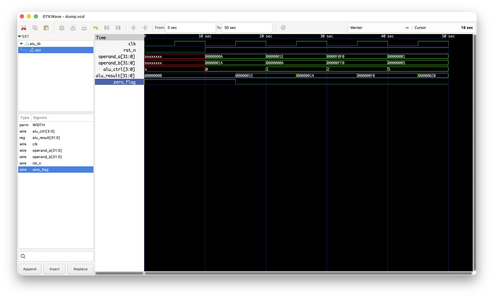

# Parameterized RISC-V ALU Design

## Overview
This project implements a **parameterized 32-bit RISC-V–style Arithmetic Logic Unit (ALU)** using Verilog/SystemVerilog.  
The ALU is designed as a **clocked RTL module** suitable for **ASIC front-end design**, focusing on correctness, clean reset behavior, and synthesizable coding practices.

The design supports multiple arithmetic and logical operations and is verified using directed RTL testbenches and waveform analysis.

---

## Features
- Parameterized data width (default: 32-bit)
- Synchronous, clocked RTL design
- Active-low asynchronous reset
- Supports arithmetic, logical, and shift operations
- Zero flag generation
- Fully synthesizable Verilog/SystemVerilog

---

## Supported Operations

| ALU Control | Operation | Description |
|------------|----------|-------------|
| `0000` | ADD | Addition |
| `0001` | SUB | Subtraction |
| `0010` | AND | Bitwise AND |
| `0011` | OR  | Bitwise OR |
| `0100` | XOR | Bitwise XOR |
| `0101` | SLL | Logical Shift Left |
| `0110` | SRL | Logical Shift Right |

---

## Design Architecture
- Inputs are sampled on the **rising edge of the clock**
- Output is **registered** to model realistic ASIC timing behavior
- ALU operation is selected using a control signal (`alu_ctrl`)
- Reset initializes outputs to a known state
- Shift operations use lower bits of operand B for shift amount

---

## Directory Structure
```text
riscv_alu/
│── rtl/
│   └── alu.sv
│
│── tb/
│   └── alu_tb.sv
│
│── sim/
│   └── run.sh
│
└── README.md
```

## Simulation & Verification

### Tools Used
- Icarus Verilog (iverilog)
- GTKWave

### Compile
```bash
iverilog -g2012 -o alu.out rtl/alu.sv tb/alu_tb.sv
```

### Run Simulation
```bash
vvp alu.out
```

### View Waveforms
```bash
gtkwave dump.vcd
```

### Verification Approach
- Directed test cases for each ALU operation
- Reset behavior verification
- Waveform-based validation of inputs, control signals, and outputs

## Sample Waveform
The waveform confirms:
- Correct reset behavior
- Output updates on the rising clock edge
- Correct results for arithmetic, logical, and shift operations
- Proper zero flag assertion

(Waveform screenshots captured using GTKWave)


## Future Enhancements
- Add self-checking testbench with automatic result comparison
- Implement SLT (Set-Less-Than) operation
- Extend parameterization for multiple data widths
- Add SystemVerilog assertions and functional coverage
- Explore synthesis and basic timing analysis

## Key Takeaways
This project demonstrates:
- RTL design using Verilog/SystemVerilog
- ASIC front-end design principles
- Clocking and reset strategies
- RTL simulation and debugging
- Structured and maintainable hardware design

## Author
### Lakshmanan Rajaram
Master’s Student – Computer Engineering

Colorado State University